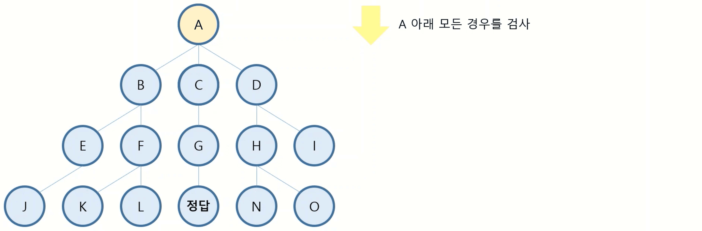
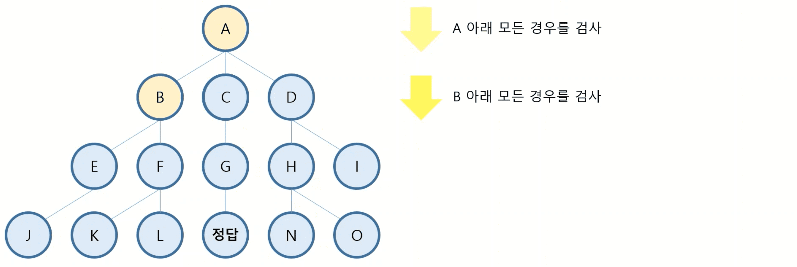
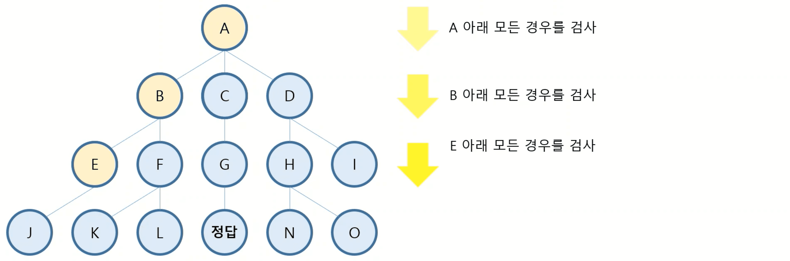

# 3주차 - 📏 깊이우선탐색과 너비우선탐색

## [✍ 강의 정리]

### PART 01 깊이우선탐색(DFS)

#### 깊이우선탐색(DFS)란?
- Depth First Search의 약자로 넓이 우선 탐색을 의미
- 하나의 경우의 수에 대하여 모든 경우의 수를 조사하고 다음 경우의 수를 조사하면서 해를 찾는 과정

#### 깊이우선탐색의 구조
|||
|---|---|
|||
|||

## [🥇 문제풀이]

### W03_1_DFS와 BFS
- [문제 원본 보기](https://www.acmicpc.net/problem/1260)
- [풀이 보기](./../code/practice/prc_w03_1_DFS와BFS.py)

 

### W03_2_바이러스
- [문제 원본 보기](https://www.acmicpc.net/problem/2606)
- [풀이 보기](./../code/practice/prc_w03_2_바이러스.py)

 

### W03_3_타겟 넘버
- [문제 원본 보기](https://www.acmicpc.net/problem/10816)
- [풀이](./../code/practice/prc_w03_3_타겟넘버.py)