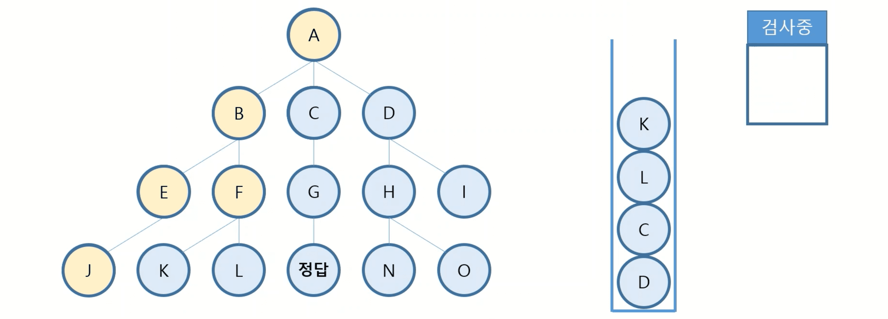
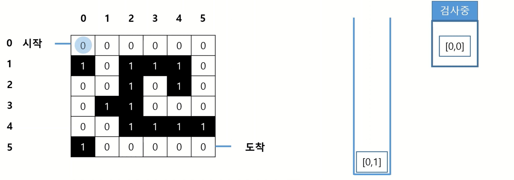
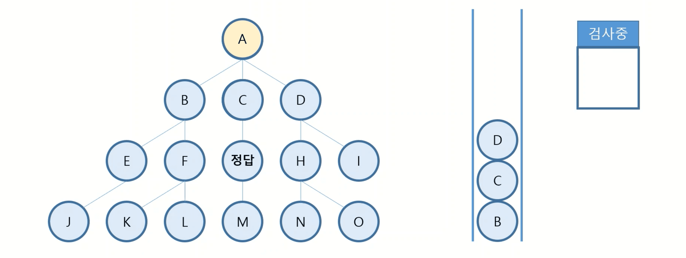
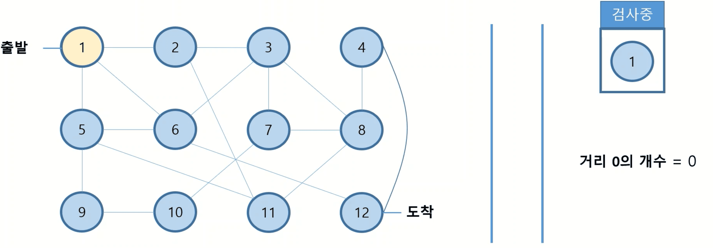

# 3주차 - 📏 깊이우선탐색과 너비우선탐색

## [✍ 강의 정리]

### PART 01 깊이우선탐색(DFS)

#### 깊이우선탐색(DFS)란?
- Depth First Search의 약자로 넓이 우선 탐색을 의미
- 하나의 경우의 수에 대하여 모든 경우의 수를 조사하고 다음 경우의 수를 조사하면서 해를 찾는 과정

<br/>

#### 깊이우선탐색(DFS)의 구조

|||
|---|---|
|||
|||
|||
|||
|||
|||
|||
|||
|||
|||
|||
|||
|||

<br/>

#### 깊이우선탐색(DFS)과 스택

||||
|---|---|---|
||||
||||
||||
||||
||||
||||
||||
||||
||||
||||
||||
||||
||||
||||
||||
||||
||||

<br/>

#### 깊이우선탐색(DFS) 구현 - 미로찾기

||||
|---|---|---|
||||
||||
||||
||||
||||
||||
||||
||||
||||
||||
||||
||||
||||
||||
||||
||||
||||
||||
||||
||||
||||
||||
||||
||||
||||
||||
||||
||||
||||
||||
||||
||||
||||
||||
||||
||||
||||
||||
||||
||||
||||
||||
||||
||||
||||

<br/>

#### 깊이우선탐색(DFS) 예시코드 - 미로찾기

```python
maps = [[0, 0, 0, 0, 0, 0],
        [1, 0, 1, 1, 1, 0],
        [0, 0, 1, 0, 1, 0],
        [0, 1, 1, 0, 0, 0],
        [0, 0, 1, 1, 1, 1],
        [1, 0, 0, 0, 0, 0]]
start = [0, 0]
dest = [5, 5]

def solution(maps, start, dest) :
    stack = [start]

    # 스택에 데이터가 있다면 계속 진행
    while len(stack) > 0 :

        # 스택의 가장 마지막 데이터 추출
        now = stack.pop()
        
        # 정답 여부 검사
        if now == dest :
            return True

        x = now[1]
        y = now[0]

        # 왼쪽으로 이동할 수 있다면
        if x - 1 > -1 :
            # 갈 수 있는 길이라면 스택에 추가하고 방문여부를 2로 표시
            if maps[y][x-1] == 0 :
                stack.append([y,x-1])
                map[y][x-1] == 2

        # 오른쪽으로 이동할 수 있다면
        if x + 1 < hori :
            if maps[y][x+1] == 0 :
                # 갈 수 있는 길이라면 스택에 추가하고 방문여부를 2로 표시
                stack.append([y,x+1])
                map[y][x+1] == 2

        # 위로 이동할 수 있다면
        if y - 1 > -1 :
            if maps[y-1][x] == 0 :
                # 갈 수 있는 길이라면 스택에 추가하고 방문여부를 2로 표시
                stack.append([y-1,x])
                map[y-1][x] == 2

        # 아래로 이동할 수 있다면
        if y + 1 < verti :
            if maps[y+1][x] == 0 :
                # 갈 수 있는 길이라면 스택에 추가하고 방문여부를 2로 표시
                stack.append([y+1,x])
                map[y+1][x] == 2

    # 스택에 데이터가 없으면 False
    return False

```

<br/>

### PART 02 너비우선탐색(BFS)

#### 너비우선탐색(BFS)란?
- Breadth First Search의 약자로 넓이 우선 탐색을 의미
- 하나의 경우의 수에 대한 다음 단계의 모든 경우의 수를 조사하면서 해를 찾는 과정

<br/>

#### 너비우선탐색(BFS)의 구조

|||
|---|---|
|||
|||
|||
|||
|||
|||
|||
|||
|||
|||
|||

<br/>

#### 너비우선탐색(BFS)과 큐

||||
|---|---|---|
||||
||||
||||
||||
||||
||||
||||
||||
||||
||||
||||
||||
||||

<br/>

#### 너비우선탐색(BFS) 구현 - 최단경로찾기

||||
|---|---|---|
||||
||||
||||
||||
||||
||||
||||
||||
||||
||||
||||
||||
||||
||||
||||
||||
||||

<br/>

#### 너비우선탐색(BFS) 예시코드 - 최단경로찾기

```python
data = [[1, 2], [1, 5], [1, 6], [2, 3], [2, 11], [3, 6], [3, 7], [3, 8], 
        [4, 8], [4, 12], [5, 6], [5, 9], [5, 11], [6, 12],
        [7, 8], [7, 10], [8, 11], [9, 10]]
start = 1
dest = 12

def solution(data, start, dest)
    # 방문 여부 표시할 리스트 생성
    visited = [False]*max(map(max, data))

    # 시작점 방문
    visited[start-1] = True

    answer = 0
    queue = []
    # 큐에 데이터가 있다면 계속 진행
    while len(queue) > 0 :

        # 같은 거리에 있는 큐 데이터 갯수
        count = len(queue)

        # 같은 거리에 있는 큐 개수만큼 검사
        for time in range(count) :
            now = queue.pop(0)

            # 정답이 존재하면 값 반환
            if now == dest :
                return answer

            # 연결된 포인트 완전 탐색
            for i in data :
                
                # 방문하지 않은 연결된 길이라면 큐에 추가하고 방문 표시
                if i[0] == now and visited[i[1]-1] == False :
                    queue.append(i[1])
                    visisted[i[1]-1] = True

                # 방문하지 않은 연결된 길이라면 큐에 추가하고 방문 표시
                elif i[1] == now and visited[i[0]-1] == False :
                    queue.append(i[0])
                    visisted[i[0]-1] = True

        # 거리 1 증가
        answer += 1

    return answer

```

<br/><br/>

## [🥇 문제풀이]

### W03_1_DFS와 BFS
- [문제 원본 보기](https://www.acmicpc.net/problem/1260)
- [풀이 보기](./../code/practice/prc_w03_1_DFS와BFS.py)

<br/>

### W03_2_바이러스
- [문제 원본 보기](https://www.acmicpc.net/problem/2606)
- [풀이 보기](./../code/practice/prc_w03_2_바이러스.py)

<br/>

### W03_3_타겟 넘버
- [문제 원본 보기](https://www.acmicpc.net/problem/10816)
- [풀이 보기](./../code/practice/prc_w03_3_타겟넘버.py)